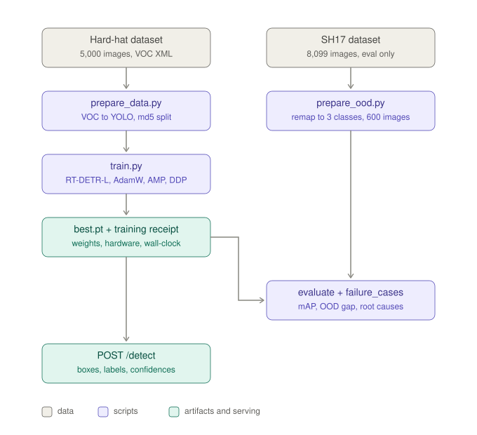
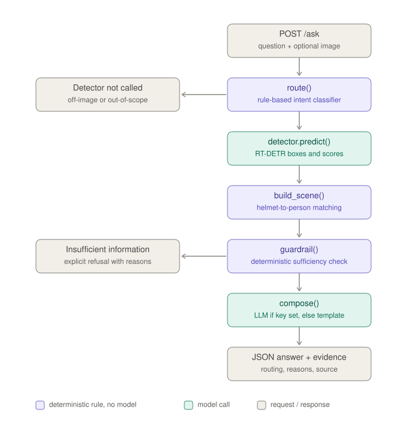

# Site Safety Compliance API

RT-DETR fine-tuned on construction-site imagery to detect **person**, **helmet**
and **head** (a human head with no helmet on it), served through FastAPI, with a
hand-written reasoning layer that answers natural-language questions about an
image and refuses when the detections do not support an answer.

Two of the three classes are outside COCO, so an off-the-shelf pretrained
checkpoint cannot do this task.

## Why this problem

Head injuries are among the leading causes of serious harm on construction
sites, and hard-hat compliance is checked today by a supervisor walking the
site. Cameras are already installed on most sites. This turns an occasional
manual spot check into a continuous one, and answers the question a safety
officer actually asks, which is not "how many helmets are visible" but
"is anyone working without one".

That distinction is the engineering content of this project. The reasoning
layer turns boxes into per-worker facts (a `helmet` box is a head with a helmet
on, a `head` box is a bare head, a `person` box with neither resolvable on it
is a worker of undetermined status) and refuses to answer, with a reason, when
the facts do not support one.

## Architecture

**Part A, detection.** The two datasets never merge: SH17 has its own path that
only meets the model at evaluation, which is the visual proof it was not
trained on. `best.pt` fans out to both evaluation and serving, so the API
loads exactly the checkpoint that was measured.



**Part B, reasoning.** Three deterministic steps (`route`, `build_scene`,
`guardrail`) run before the single optional model call in `compose`. Both
side exits are correct outputs, not errors: "not about the image" and
"insufficient information" are answers the system is designed to give.



## Layout

```
docs/architecture_part_*.svg   the two diagrams above
scripts/prepare_data.py    Pascal VOC XML -> YOLO, deterministic image-level split
scripts/prepare_ood.py     SH17 -> a remapped out-of-distribution test set
scripts/train.py           RT-DETR fine-tune, writes a reproducibility receipt
scripts/evaluate.py        mAP / precision / recall on in-domain and OOD splits
scripts/failure_cases.py   mines the worst images and measures why they failed
scripts/download_weights.py  fetches best.pt from the GitHub release
memo/MEMO.md, MEMO.pdf     the two-page memo; memo/build_pdf.py renders it
artifacts/                 metrics, receipt, split stats, failure report + annotated images
app/detector.py            RT-DETR inference wrapper
app/scene.py               helmet-to-person association, per-worker compliance
app/reasoning.py           intent routing, confidence guardrail, answer composition
app/main.py                FastAPI endpoints
space_app.py               Gradio demo page + the same API, for a free Hugging Face Space
tests/test_reasoning.py    routing, association and guardrail tests, no GPU needed
notebooks/kaggle_ppe_rtdetr.ipynb   self-contained Kaggle notebook: datasets, training, eval, export
notebooks/build_kaggle_notebook.py  regenerates the notebook from the scripts above
```

## Data

| | Source | Role |
|---|---|---|
| Training | [Safety Helmet Detection](https://www.kaggle.com/datasets/andrewmvd/hard-hat-detection), 5,000 images, Pascal VOC XML, classes helmet / head / person | train, val, in-domain test |
| Generalisation check | [SH17](https://www.kaggle.com/datasets/mugheesahmad/sh17-dataset-for-ppe-detection), 8,099 images, CC BY-NC-SA 4.0 | out-of-distribution test only, never trained on |

The split is a hash of the image file stem, so re-running the preparation
script never moves an image between splits and re-running it after adding data
cannot leak a training image into the test set.

SH17 is scraped from stock photography and the training set is real site
imagery, so the gap between the two mAP numbers is a direct measurement of how
much of the model's accuracy is dataset-specific.

## Training on the Kaggle free tier

Upload `notebooks/kaggle_ppe_rtdetr.ipynb` as a new Kaggle notebook. Set
Accelerator GPU T4 x2 and Internet on; no datasets need attaching, both are
fetched by `kagglehub` inside the notebook. The P100 also works, but Kaggle's
current torch build has dropped sm_60 kernels, so the notebook's first cell
detects that and installs torch 2.6 (cu126) before training. RT-DETR is attention heavy:
batch 8 per GPU at 640 px is the largest that fits reliably on a 16 GB card, so
the notebook uses batch 16 across the two T4s with DDP. Launch through
**Save Version, Save and Run All** so a disconnect does not kill the run.

The notebook embeds every script in `scripts/` and `app/`; after changing any
of them run `python notebooks/build_kaggle_notebook.py` to regenerate it. The
equivalent shell steps are:

```bash
python scripts/prepare_data.py --root /kaggle/input/hard-hat-detection --out /kaggle/working/data/ppe
python scripts/train.py --data /kaggle/working/data/ppe/data.yaml --epochs 40 --batch 16 \
    --device 0,1 --cache ram --project /kaggle/working/runs --name rtdetr_ppe
```

Run two epochs first and multiply the reported seconds per epoch out before
committing the full budget. `training_receipt.json` records the GPU, driver,
every hyperparameter and the wall-clock time. Copy it into the memo verbatim.

## Evaluation

```bash
python scripts/evaluate.py --weights runs/rtdetr_ppe/weights/best.pt \
    --data data/ppe/data.yaml --ood data/ood_sh17/data.yaml --out artifacts/metrics.json

python scripts/failure_cases.py --weights runs/rtdetr_ppe/weights/best.pt \
    --data data/ppe/data.yaml --top 8 --out artifacts/failures
```

The failure miner ranks test images by error count, then for every miss it
measures Laplacian variance over the missed region (blur), box area as a
fraction of the image (scale), overlap with neighbouring ground-truth boxes
(occlusion) and mean luminance (exposure). It proposes a cause from those
measurements. Confirm each one by eye before it goes in the memo.

## Weights

The fine-tuned checkpoint (`best.pt`, 66 MB, optimizer stripped) is a GitHub
release asset, a plain HTTPS download with no account needed:

**https://github.com/KanagavelAK/ppe-rtdetr/releases/download/v1.0/best.pt**

Three ways to get it, any one is enough:

```bash
python scripts/download_weights.py          # -> artifacts/best.pt
```

- Or do nothing: the API downloads it from `WEIGHTS_URL` on first start if
  `artifacts/best.pt` is missing (`.env.example` and the Dockerfile set it).
- Or regenerate it: run `notebooks/kaggle_ppe_rtdetr.ipynb` on Kaggle
  (Save & Run All, GPU T4 x2) and take `best.pt` from the Output tab.

`samples/` holds two images from the held-out test split (chosen by the same
md5 rule as the split, so they were never trained on) for trying the endpoints
below. The first request after start-up is slow on CPU (5-8 s, kernel warm-up);
later requests take roughly 0.6 s.

## Running the API

```bash
pip install -r requirements.txt
cp .env.example .env          # point MODEL_WEIGHTS at the checkpoint
uvicorn app.main:app --host 0.0.0.0 --port 8000
```

Interactive docs are at `http://localhost:8000/docs`.

With Docker:

```bash
docker build -t ppe-api . && docker run -p 8000:8000 --env-file .env ppe-api
```

The reasoning layer runs without an `ANTHROPIC_API_KEY`. Without one it answers
from templates over the same structured facts, so every endpoint is fully
exercisable offline. With one set, the final phrasing step is a single direct
Messages API call. No agent framework is used anywhere.

This is deliberate. Routing and the guardrail are the decisions that matter,
and both are deterministic and run before any model is called. The language
model only rephrases facts that have already been judged sufficient, so the
API's correctness does not depend on it, and a reviewer without a key sees
identical routing, evidence and refusals with `answer_source: "template"`.

## Deployment (Hugging Face Space, free CPU tier)

`space_app.py` mounts the FastAPI app inside a Gradio app, so one free Space
serves the demo page at `/` and the unchanged API at `/detect`, `/ask`, `/docs`.
The YAML block at the top of this README is the Space's configuration.

```bash
python space_app.py            # local: http://localhost:7860  (page)  and /docs (API)
```

To publish: create a Space (SDK **Gradio**, hardware **CPU basic**), then

```bash
git remote add hf https://huggingface.co/spaces/<your-hf-username>/ppe-rtdetr
git push hf main
```

The Space installs `requirements.txt`, downloads `best.pt` from the GitHub
release on first start (`WEIGHTS_URL`), and listens on 7860. Free
Spaces sleep after 48 h without traffic; the first request afterwards takes
about a minute to wake. Live instance: **TODO: paste the Space URL here**.

## Endpoints

### `POST /detect`

```bash
curl -X POST http://localhost:8000/detect \
  -F "file=@samples/site_01.png" -F "confidence=0.25"
```

Real output for that image (CPU, second request; the first after start-up is
slower while kernels warm up):

```json
{
  "request_id": "261ae5f73801",
  "image": {"width": 416, "height": 415},
  "confidence_threshold": 0.25,
  "count": 4,
  "counts_by_class": {"helmet": 4},
  "detections": [
    {"label": "helmet", "confidence": 0.9073, "box_xyxy": [292.7, 103.0, 370.8, 197.1]},
    {"label": "helmet", "confidence": 0.9052, "box_xyxy": [75.7, 96.5, 159.3, 196.2]},
    {"label": "helmet", "confidence": 0.88,   "box_xyxy": [291.1, 0.1, 374.2, 34.4]},
    {"label": "helmet", "confidence": 0.8747, "box_xyxy": [68.7, -0.1, 165.0, 41.8]}
  ],
  "inference_ms": 735.0
}
```

### `POST /ask`

Compliance question, answerable (real output for `samples/site_01.png`):

```bash
curl -X POST http://localhost:8000/ask \
  -F "file=@samples/site_01.png" \
  -F "question=Is anyone not wearing a helmet?"
```

```json
{
  "request_id": "09810af1db03",
  "question": "Is anyone not wearing a helmet?",
  "answer": "Of 4 people detected, 4 are wearing a helmet and 0 are not.",
  "sufficient_information": true,
  "routing": {
    "needs_detection": true,
    "question_kind": "compliance",
    "rationale": "the question is about who is or is not wearing a helmet, which needs per-person detections",
    "decided_by": "rules"
  },
  "detector_called": true,
  "guardrail_reasons": [],
  "answer_source": "template",
  "evidence": {
    "counts": {"helmet": 4},
    "people_detected": 4,
    "person_boxes": 0,
    "compliant_workers": 4,
    "violations": 0,
    "undetermined_workers": 0,
    "helmets_seen_but_not_worn": 0,
    "max_confidence": 0.9073,
    "mean_confidence": 0.8918,
    "workers": [
      {"id": 0, "status": "compliant", "headgear": "helmet", "headgear_confidence": 0.9073,
       "note": "status read from the headgear box alone; no person box was detected"},
      {"id": 1, "status": "compliant", "headgear": "helmet", "headgear_confidence": 0.9052, "note": "..."},
      {"id": 2, "status": "compliant", "headgear": "helmet", "headgear_confidence": 0.88,   "note": "..."},
      {"id": 3, "status": "compliant", "headgear": "helmet", "headgear_confidence": 0.8747, "note": "..."}
    ],
    "detections": ["... the same four boxes as /detect ..."]
  },
  "inference_ms": 805.0
}
```

`answer_source` is `"template"` because no `ANTHROPIC_API_KEY` was set; with one
it reads `"llm"` and the answer is phrased by the model from the same evidence.

Question that does not need the detector:

```bash
curl -X POST http://localhost:8000/ask -F "question=What is the capital of France?"
```

```json
{
  "request_id": "e7f127a5fea4",
  "question": "What is the capital of France?",
  "answer": "That question is not about the contents of the image, so I did not run the detector.",
  "sufficient_information": false,
  "routing": {"needs_detection": false, "question_kind": "not_about_the_image",
              "rationale": "the question asks about something other than the contents of the image, so running the detector would not inform it",
              "decided_by": "rules"},
  "detector_called": false,
  "guardrail_reasons": ["the question asks about something other than the contents of the image, so running the detector would not inform it"],
  "answer_source": "template",
  "evidence": null,
  "inference_ms": null
}
```

Question about the image, but outside what the detector can see:

```json
{
  "question": "What colour is the truck?",
  "answer": "I cannot answer that. This detector only recognises people, helmets and bare heads, so the attribute you asked about is outside what it can measure.",
  "sufficient_information": false,
  "routing": {"needs_detection": false, "question_kind": "out_of_detector_scope", "decided_by": "rules"},
  "detector_called": false,
  "answer_source": "template"
}
```

Question the detections cannot honestly support (the worked example from
`tests/test_reasoning.py`: three people, two with helmets, one whose head is
occluded):

```json
{
  "question": "Is anyone not wearing a helmet?",
  "answer": "I do not have enough information to answer that confidently. 1 of 3 detected people have no helmet and no bare head associated with them, most likely because their head is occluded, cropped or too small to resolve.",
  "sufficient_information": false,
  "detector_called": true,
  "guardrail_reasons": ["1 of 3 detected people have no helmet and no bare head associated with them, most likely because their head is occluded, cropped or too small to resolve"],
  "answer_source": "template"
}
```

## How the reasoning layer decides

1. **Route.** A deterministic rule pass classifies the question into one of six
   kinds. Questions naming nothing the detector can see, and questions about
   visual attributes outside the three classes, both skip detection entirely.
   Routing is a cheap, closed-vocabulary decision, so a rule set is faster than
   a model call and cannot hallucinate a route.
2. **Detect and structure.** The detector runs, then `app/scene.py` turns boxes
   into workers. In this dataset a `helmet` box is a head with a helmet on and a
   `head` box is a bare head, so each headgear box is one worker's status. Person
   boxes, when the model emits them (rarely: see Limits), refine that: a helmet
   inside a person box but off their head is being carried and is not credited,
   and a person with no headgear resolvable in their head zone is *undetermined*,
   never compliant and never a violation.
3. **Guard.** A deterministic check, before any language model call, decides
   whether the facts support an answer. Empty detections, an all-weak scene, or
   any worker whose headgear could not be resolved makes a compliance question
   unanswerable.
4. **Compose.** Only if the guard passes does the language model turn the facts
   into a sentence, and it is instructed to use nothing but those facts.

The guardrail is deliberately not the model's own confidence estimate. A model
asked to grade itself will talk itself into an answer. A rule that says three of
five workers have no resolvable headgear will not.

## Tests

```bash
python -m pytest tests -q
```

Fourteen tests cover routing, the association rule (including a helmet carried
by a visible worker that must not be credited, and headgear with no person box
that must be), and the guardrail's insufficient-information path. None of them
need a GPU or a checkpoint.

## How this maps to the brief

| Brief requirement | Where to check |
|---|---|
| RT-DETR, own training code, no AutoML | `scripts/train.py` (Ultralytics RT-DETR-L, one `model.train` call, every hyperparameter on the CLI) |
| At least one non-COCO class | `helmet`, `head` |
| Own dataset, sourcing and split documented | `scripts/prepare_data.py`, `artifacts/split_stats.json`, memo sections 1-2 |
| mAP, precision/recall, confusion behaviour | `scripts/evaluate.py`, `artifacts/metrics.json`, confusion matrix from the run, memo section 3 |
| FastAPI: image in, boxes + labels + confidences out | `POST /detect` |
| Second endpoint: intent routing, structured reasoning, confidence guardrail | `POST /ask`; `app/reasoning.py:route`, `app/scene.py:build_scene`, `app/reasoning.py:guardrail` |
| Explicit "insufficient information" | `guardrail()` + `insufficient_message()`; worked example in `tests/test_reasoning.py` and memo section 5 |
| No agentic frameworks | `requirements.txt` has none; `grep -ri langchain\|crewai\|autogen\|langgraph` is empty |
| Reproducibility: steps, environment, hardware, time, hyperparameters | `notebooks/kaggle_ppe_rtdetr.ipynb`, `requirements.txt`, `Dockerfile`, `artifacts/training_receipt.json` |
| Weights with a working load path | GitHub release v1.0 + `scripts/download_weights.py` + auto-fetch in `app/detector.py` |
| Five failure cases with root cause | `scripts/failure_cases.py`, `artifacts/failures/`, memo section 4 |
| API usage with sample payloads for both endpoints | Endpoints section above, `samples/` |
| Bonus: Docker, logging, error handling | `Dockerfile` with healthcheck; request-id middleware; typed `ErrorResponse` on 400/500 |

## Limits

- Three classes only. Vests, gloves, harnesses and boots are not detected, and
  the API says so rather than guessing.
- The `person` class barely works (test mAP50 0.008, recall 0.03) because the
  source dataset draws a person box on only ~3 percent of workers (497 person
  vs 12,908 helmet instances in training), so the model learned not to predict
  it. Helmet (mAP50 0.96) and bare head (0.91) are strong, and compliance is
  computed from those. The cost is that a helmet the model sees but nobody is
  wearing, with no person box around it to say so, is counted as a compliant
  worker.
- Training images are predominantly daytime outdoor construction scenes. Indoor
  industrial and low-light footage is outside the training distribution, which
  is what the SH17 number partially measures.
