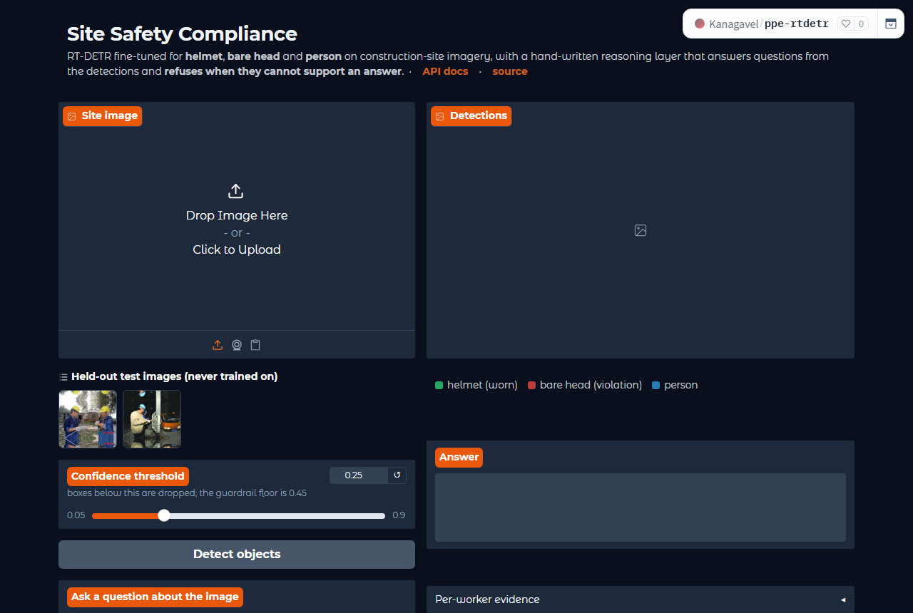
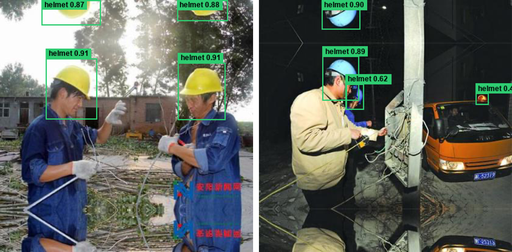
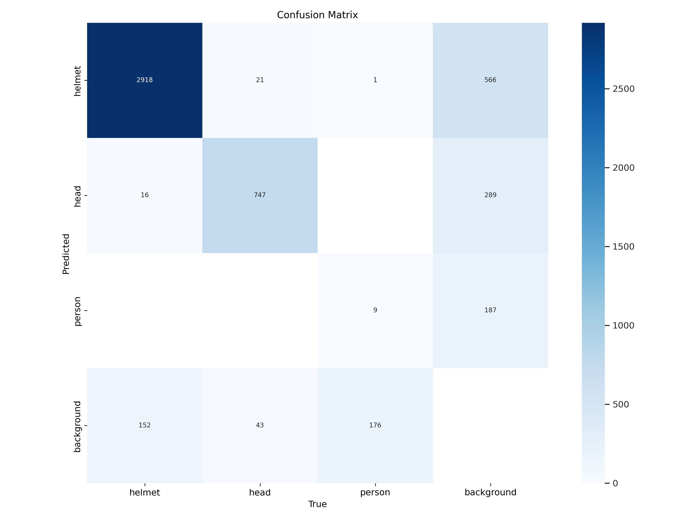
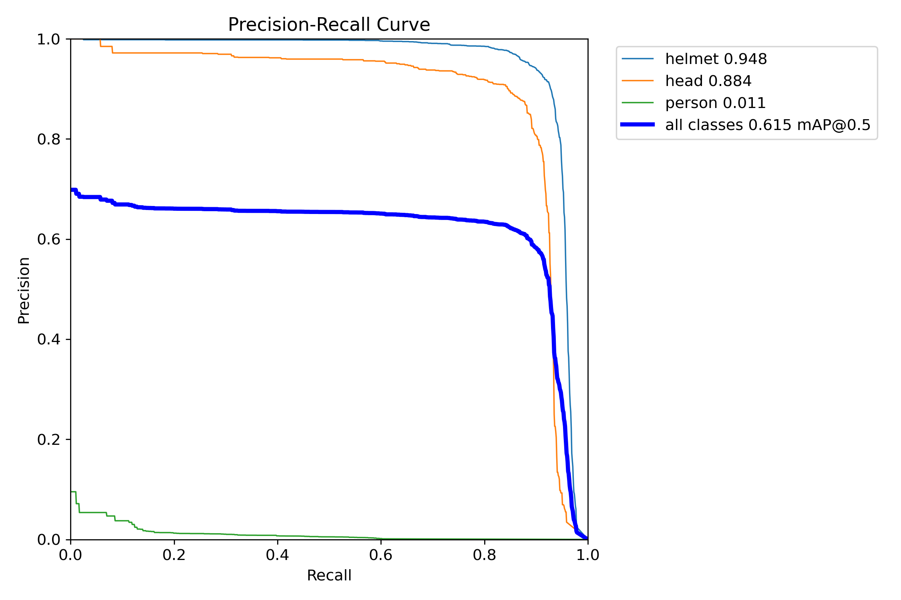
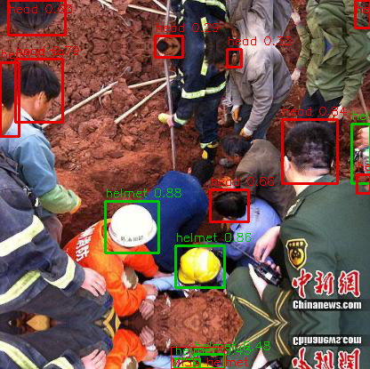

# Site Safety Compliance API

[](https://kanagavel-ppe-rtdetr.hf.space)
[](https://github.com/KanagavelAK/ppe-rtdetr/releases/download/v1.0/best.pt)
[](memo/MEMO.pdf)


RT-DETR fine-tuned on construction-site imagery to detect **helmet**, **head**
(a bare head, no helmet) and **person**, served through FastAPI, with a
hand-written reasoning layer that answers natural-language questions about an
image and **refuses, with a reason, when the detections cannot support an
answer**. Two of the three classes are outside COCO, so no off-the-shelf
checkpoint can do this.

| | |
|---|---|
| **Live demo + API** | https://kanagavel-ppe-rtdetr.hf.space · Swagger at [`/api/docs`](https://kanagavel-ppe-rtdetr.hf.space/api/docs) |
| **Weights** | [`best.pt`, 66 MB, GitHub release v1.0](https://github.com/KanagavelAK/ppe-rtdetr/releases/download/v1.0/best.pt) |
| **Memo** | [memo/MEMO.pdf](memo/MEMO.pdf) (2 pages) · source [memo/MEMO.md](memo/MEMO.md) |
| **Reproduce training** | [notebooks/kaggle_ppe_rtdetr.ipynb](notebooks/kaggle_ppe_rtdetr.ipynb), Kaggle free tier, one Save & Run All |
| **Metrics and receipts** | [artifacts/](artifacts/) — `metrics.json`, `training_receipt.json`, `split_stats.json`, `failures/` |





*Model output on the two held-out `samples/`. The boxes touching the top edge
of the left image sit in the dataset's mirrored padding strip; see Failure
analysis.*

## Why this problem

Head injury is among the leading causes of serious harm on construction sites,
and hard-hat compliance is checked today by a supervisor walking the site.
Cameras are already installed on most sites. The question a safety officer
asks is not "how many helmets are visible" but "is anyone working without
one", and that is a relation between boxes, not a count. The reasoning layer
turns boxes into per-worker facts and refuses to answer when they are not
enough.

## Results

Trained 40 epochs on 3,447 images (2 × T4, 1.71 h). Evaluated on a held-out
in-domain test split and on SH17, a different dataset never trained on.
Full numbers: [artifacts/metrics.json](artifacts/metrics.json).

| Split | mAP@50 | mAP@50-95 | Precision | Recall |
|---|---|---|---|---|
| In-domain test, 755 images | 0.627 | 0.412 | 0.628 | 0.617 |
| SH17 out-of-distribution, 600 images | 0.026 | 0.011 | 0.053 | 0.036 |

| Class (in-domain) | Precision | Recall | mAP@50 | mAP@50-95 |
|---|---|---|---|---|
| helmet | 0.927 | 0.930 | **0.959** | 0.629 |
| head | 0.877 | 0.890 | **0.914** | 0.602 |
| person | 0.078 | 0.029 | 0.008 | 0.005 |

**How to read this.** The two non-COCO classes, which are what the task is
about, are strong. `person` collapsed because the source dataset draws a
person box on only ~3 % of workers (497 person vs 12,908 helmet instances in
training), so the model learned not to predict it; the confusion matrix sends
person ground truth to background, not to another class. The OOD figure is a
lower bound: SH17 labels `head` on helmeted heads too, so a correct bare-head
model scores zero on that class by construction. Both are discussed honestly
in memo §3.

<p align="center"> </p>

**Performance.** RT-DETR-L, 32 M parameters, 105 GFLOPs at 640 px, weights
66 MB. Inference per image: 14.6 ms on a T4 GPU; on CPU about 0.2 s on the
Space (steady state), 0.6 s on a laptop, and 2 s for the first request after
start-up while kernels warm up. Requests are serialised behind a lock (the
Ultralytics predictor is not re-entrant), so throughput is one image at a time
per process.

## Architecture

**Part A, detection.** The two datasets never merge: SH17 has its own path
that only meets the model at evaluation. `best.pt` fans out to both evaluation
and serving, so the API loads exactly the checkpoint that was measured.


**Part B, reasoning.** Three deterministic steps (`route`, `build_scene`,
`guardrail`) run before the single optional model call in `compose`. Both
side exits are correct outputs, not errors.


### How the reasoning layer decides

1. **Route.** A rule pass over a closed vocabulary classifies the question
   into one of six kinds: `compliance`, `count`, `presence`, `summary`,
   `not_about_the_image`, `out_of_detector_scope`. The last two skip the
   detector: not about the image (*capital of France*) and about the image but
   outside the class list (*what colour is the truck*). Rules are faster than
   a model call and cannot hallucinate a route.
2. **Detect and structure.** `app/scene.py` turns boxes into workers. A
   `helmet` box is a head with a helmet on and a `head` box is a bare head, so
   each is one worker's status. Person boxes, when present, refine that: a
   helmet inside a person box but off their head is being carried and is not
   credited; a person with nothing resolvable in their head zone is
   *undetermined*, never compliant and never a violation.
3. **Guard.** Deterministic, before any language model: refuse on no
   detections, on all detections below 0.45, and for compliance questions on
   any undetermined worker. The model is never asked to rate its own
   confidence.
4. **Compose.** Only if the guard passes, one direct Anthropic Messages API
   call phrases the facts. With no `ANTHROPIC_API_KEY` the same facts are
   phrased from templates and `answer_source` says so, so the API is fully
   exercisable offline. No agent framework anywhere.

## Failure analysis

`scripts/failure_cases.py` ranks test images by error count and measures
every miss for scale, blur, occlusion and exposure. Five cases are written up
in memo §4 with the annotated images in [artifacts/failures/](artifacts/failures/).
What they showed:

- Genuine model errors are specific: heads under 0.15 % of the image at night,
  a helmet cut by the frame edge returned as two fragments, a white rice bowl
  called `helmet`, duplicate boxes from RT-DETR's set prediction (no NMS).
- Most of the error *count* is the ground truth: unlabelled people in crowds,
  no `person` boxes, and a mirrored padding border the dataset labels
  inconsistently.
- Every duplicate box scored below 0.45, which is why the API's guardrail
  floor is set there.

<p align="center"></p>

*Case 5: three ground-truth boxes, fourteen predictions. The "false positive"
heads are real, unlabelled rescuers seen from behind; the one miss is the
helmet cut by the bottom edge, returned as two fragments (green boxes at the
bottom).*

## Quickstart

Python 3.10 to 3.13 (tested on 3.10 in the Space, 3.11 in Docker, 3.12 on
Kaggle, 3.13 locally). No GPU needed to serve.

```bash
git clone https://github.com/KanagavelAK/ppe-rtdetr && cd ppe-rtdetr
pip install -r requirements.txt
cp .env.example .env
uvicorn app.main:app --host 0.0.0.0 --port 8000     # downloads best.pt on first start
```

Swagger UI at http://localhost:8000/docs. Two held-out images are in
`samples/`. The first request after start-up is slow on CPU (kernel warm-up);
later ones take about 0.6 s.

Docker: `docker build -t ppe-api . && docker run -p 8000:8000 ppe-api`

Demo page + API in one process, as deployed on the Space:
`python space_app.py` → http://localhost:7860

Tests (no GPU or checkpoint needed): `python -m pytest tests -q` — 14 tests
covering routing, the association rule and the guardrail.

### Configuration

All settings are environment variables; `.env.example` lists them with
defaults, and `uvicorn` picks up a `.env` automatically.

| Variable | Default | Meaning |
|---|---|---|
| `MODEL_WEIGHTS` | `artifacts/best.pt` | checkpoint path |
| `WEIGHTS_URL` | GitHub release v1.0 | where to fetch the checkpoint if the file is missing |
| `WEIGHTS_KAGGLE_DATASET` | empty | optional alternative source, `owner/slug` of a Kaggle dataset |
| `CONF_THRESHOLD` | `0.25` | default detection confidence cut-off (per-request override: form field `confidence`) |
| `IMGSZ` | `640` | inference size; must match training |
| `DETECTOR_DEVICE` | empty | empty lets Ultralytics choose; `cpu` pins inference to CPU |
| `LOW_CONFIDENCE_FLOOR` | `0.45` | guardrail: below this no assertion is made |
| `ANTHROPIC_API_KEY` | unset | optional; enables the language-model phrasing step |
| `ANTHROPIC_MODEL` | `claude-opus-5` | model for that single call |
| `MAX_UPLOAD_BYTES` | `12582912` | 12 MB upload limit; larger files get a 400 |
| `LOG_LEVEL` | `INFO` | one line per request with method, path, status, latency, request id |

## API

Real responses from the trained model on `samples/site_01.png`. On the live
Space the paths are prefixed with `/api`.

### `POST /detect` — image → boxes, labels, confidences

```bash
curl -X POST http://localhost:8000/detect -F "file=@samples/site_01.png" -F "confidence=0.25"
```

```json
{
  "request_id": "261ae5f73801",
  "image": {"width": 416, "height": 415},
  "confidence_threshold": 0.25,
  "count": 4,
  "counts_by_class": {"helmet": 4},
  "detections": [
    {"label": "helmet", "confidence": 0.9073, "box_xyxy": [292.7, 103.0, 370.8, 197.1]},
    {"label": "helmet", "confidence": 0.9052, "box_xyxy": [75.7, 96.5, 159.3, 196.2]},
    {"label": "helmet", "confidence": 0.88,   "box_xyxy": [291.1, 0.1, 374.2, 34.4]},
    {"label": "helmet", "confidence": 0.8747, "box_xyxy": [68.7, -0.1, 165.0, 41.8]}
  ],
  "inference_ms": 735.0
}
```

### `POST /ask` — image + question → answer, or an honest refusal

```bash
curl -X POST http://localhost:8000/ask -F "file=@samples/site_01.png" \
  -F "question=Is anyone not wearing a helmet?"
```

```json
{
  "question": "Is anyone not wearing a helmet?",
  "answer": "Of 4 people detected, 4 are wearing a helmet and 0 are not.",
  "sufficient_information": true,
  "routing": {"needs_detection": true, "question_kind": "compliance",
              "rationale": "the question is about who is or is not wearing a helmet, which needs per-person detections",
              "decided_by": "rules"},
  "detector_called": true,
  "guardrail_reasons": [],
  "answer_source": "template",
  "evidence": {
    "counts": {"helmet": 4}, "people_detected": 4, "person_boxes": 0,
    "compliant_workers": 4, "violations": 0, "undetermined_workers": 0,
    "workers": [{"id": 0, "status": "compliant", "headgear": "helmet", "headgear_confidence": 0.9073}, "..."]
  },
  "inference_ms": 805.0
}
```

The three other kinds of answer, with the same fields:

| Question | `question_kind` | `detector_called` | Answer |
|---|---|---|---|
| What is the capital of France? | `not_about_the_image` | false | That question is not about the contents of the image, so I did not run the detector. |
| What colour is the truck? | `out_of_detector_scope` | false | I cannot answer that. This detector only recognises people, helmets and bare heads… |
| Is anyone not wearing a helmet? *(third worker's head occluded)* | `compliance` | true | I do not have enough information to answer that confidently. 1 of 3 detected people have no helmet and no bare head associated with them… |

Every response carries `routing`, `detector_called`, `guardrail_reasons` and
`answer_source`, so you can see why it answered or refused without logs.
Errors return a typed `{request_id, error, detail}` with 400 (bad upload) or
500, and every response has an `x-request-id` header that matches the log line.

### `GET /health`

`{"status": "ok", "model_loaded": true, "weights": "...", "classes": [...], "llm_enabled": false}`

## Data

| | Source | Role |
|---|---|---|
| Training | [Safety Helmet Detection](https://www.kaggle.com/datasets/andrewmvd/hard-hat-detection), 5,000 images, Pascal VOC XML | train / val / in-domain test |
| Generalisation check | [SH17](https://www.kaggle.com/datasets/mugheesahmad/sh17-dataset-for-ppe-detection), 8,099 stock photos, CC BY-NC-SA 4.0 | out-of-distribution test only |

**Split.** `md5(file stem)` bucketed 15 / 15 / 70 into test / val / train at
image level. The dataset has near-duplicate frames, so a random split would
inflate test mAP; and because the assignment is a pure function of the
filename, re-running or adding data can never leak a training image into
test. The `samples/` images were chosen by the same rule.

| Split | Images | helmet | head | person |
|---|---|---|---|---|
| train | 3,447 | 12,908 | 4,089 | 497 |
| val | 798 | 3,086 | 811 | 186 |
| test | 755 | 2,972 | 885 | 68 |

## Training and reproducibility

Everything is in one Kaggle notebook: upload
[notebooks/kaggle_ppe_rtdetr.ipynb](notebooks/kaggle_ppe_rtdetr.ipynb), set
Accelerator **GPU T4 x2** and Internet **on**, attach no datasets (both are
fetched by `kagglehub`), and **Save Version → Save & Run All**. It prepares the
data, trains, evaluates in-domain and OOD, mines failure cases, checks the
reasoning layer end to end, and zips `best.pt` with every receipt.

| | |
|---|---|
| Model | `rtdetr-l.pt` (COCO-pretrained) → 3 classes |
| Hardware | Kaggle free tier, 2 × Tesla T4 15 GB, DDP |
| Software | Python 3.12, torch 2.10+cu128, Ultralytics 8.3.40 |
| Hyperparameters | 40 epochs, batch 16 (8 per GPU), imgsz 640, AdamW, lr0 1e-4, AMP, RAM cache, seed 0, patience 12 |
| Wall-clock | 6,168 s (1.71 h) — [artifacts/training_receipt.json](artifacts/training_receipt.json) |

The notebook embeds every script in `scripts/` and `app/`; after changing any
of them run `python notebooks/build_kaggle_notebook.py` to regenerate it. The
equivalent shell steps:

```bash
python scripts/prepare_data.py --root <hard-hat-dataset> --out data/ppe
python scripts/train.py --data data/ppe/data.yaml --epochs 40 --batch 16 --device 0,1 --cache ram
python scripts/prepare_ood.py --root <sh17-dataset> --out data/ood_sh17 --limit 600
python scripts/evaluate.py --weights runs/rtdetr_ppe/weights/best.pt --data data/ppe/data.yaml --ood data/ood_sh17/data.yaml
python scripts/failure_cases.py --weights runs/rtdetr_ppe/weights/best.pt --data data/ppe/data.yaml --top 8
```

## Deployment

The live instance is a free Hugging Face Space (Gradio SDK, ZeroGPU tier).
`space_app.py` mounts the FastAPI app inside a Gradio app, so one process
serves the demo page at `/` and the API under `/api/`. Everything runs on CPU:
ZeroGPU requires at least one `@spaces.GPU` function to start, so the file
carries a placeholder that is never called, and no request reserves a GPU or
consumes GPU quota. Free Spaces sleep after 48 h idle and wake in about a
minute on the next request.
The YAML block at the top of this file is the Space's configuration; to deploy
your own copy, create a Space with SDK Gradio and push this repo to it.

## Repository layout

```
app/main.py                 FastAPI: /health, /detect, /ask
app/detector.py             RT-DETR inference wrapper; downloads weights if missing
app/scene.py                boxes -> per-worker compliance facts
app/reasoning.py            routing, guardrail, answer composition
app/schemas.py              response models
space_app.py                Gradio demo page + the same API (Hugging Face Space)
scripts/prepare_data.py     Pascal VOC -> YOLO, deterministic image-level split
scripts/prepare_ood.py      SH17 -> remapped out-of-distribution test set
scripts/train.py            RT-DETR fine-tune; writes training_receipt.json
scripts/evaluate.py         mAP / precision / recall, in-domain and OOD
scripts/failure_cases.py    worst images with measured root causes
scripts/download_weights.py fetches best.pt from the GitHub release
tests/test_reasoning.py     14 tests, no GPU needed
notebooks/                  the Kaggle notebook and its generator
artifacts/                  metrics, receipts, plots, failure report + images
docs/                       the two architecture diagrams
memo/                       MEMO.md, MEMO.pdf, build_pdf.py
samples/                    two held-out test images
Dockerfile                  CPU image with a /health healthcheck
requirements.txt, .env.example, LICENSE
```

## How this maps to the brief

| Requirement | Where |
|---|---|
| RT-DETR, own training code, no AutoML | `scripts/train.py` |
| At least one non-COCO class | `helmet`, `head` |
| Own dataset, sourcing and split documented | Data section, memo §1-2, `artifacts/split_stats.json` |
| mAP, precision/recall, confusion behaviour | Results section, `artifacts/metrics.json`, confusion matrix |
| FastAPI: image → boxes, labels, confidences | `POST /detect` |
| Second endpoint: routing, structured reasoning, guardrail | `POST /ask`; `route()`, `build_scene()`, `guardrail()` |
| Explicit "insufficient information" | `guardrail()` + `insufficient_message()`; worked example in tests and memo §5 |
| No agentic frameworks | none in `requirements.txt`; the control flow is four function calls |
| Reproducibility: steps, environment, hardware, time, hyperparameters | notebook, `requirements.txt`, Dockerfile, `training_receipt.json` |
| Weights with a working load path | GitHub release + `scripts/download_weights.py` + auto-fetch in `app/detector.py` |
| Five failure cases with root cause | memo §4, `artifacts/failures/` |
| API usage with sample payloads | API section, `samples/` |
| Bonus: Docker, deployment, logging, error handling | `Dockerfile`, live Space, request-id middleware, typed errors |

## What changed along the way

Four pivots, all recorded in memo §7:

1. Kaggle's P100 stopped working with the current torch build (no sm_60
   kernels), so training moved to 2 × T4 with DDP.
2. Ultralytics' Ray Tune callback crashed after epoch 1 on Kaggle's newer
   `ray`; it is disabled in `train.py`.
3. Compliance was first anchored on `person` boxes. With person recall at
   0.03 that refused nearly every real question, so the rule was inverted:
   headgear defines the worker, person boxes only refine, and the refusal is
   kept where it is honest (a visible person with no resolvable head).
4. The Space went through five deploy iterations (dependency clash, Gradio
   SSR port, runner expectations, ZeroGPU rules); each is a comment in
   `space_app.py`.

## Limits

- Three classes only. Vests, gloves, harnesses and boots are not detected, and
  the API says so rather than guessing.
- `person` is effectively not detected (recall 0.03) because of the source
  labelling convention. Compliance is computed from helmet and head boxes, so
  a helmet the model sees but nobody is wearing, with no person box around it
  to say so, counts as a compliant worker.
- Training images are daytime outdoor construction scenes at 416 px. Night,
  indoor and close-up footage is outside the distribution; the SH17 number
  is a partial measure of that.

## Licence

MIT for the code (see [LICENSE](LICENSE)). The training data is the Kaggle
Safety Helmet Detection dataset; CC0 1.0 Public Domain. SH17 is
CC BY-NC-SA 4.0 and was used for evaluation only.
